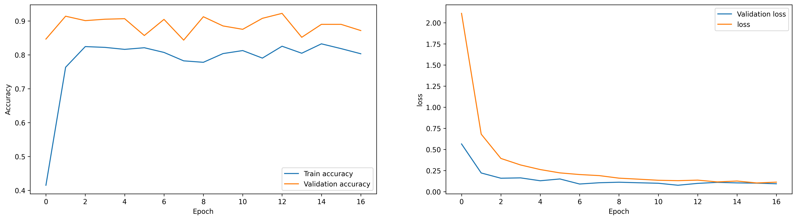
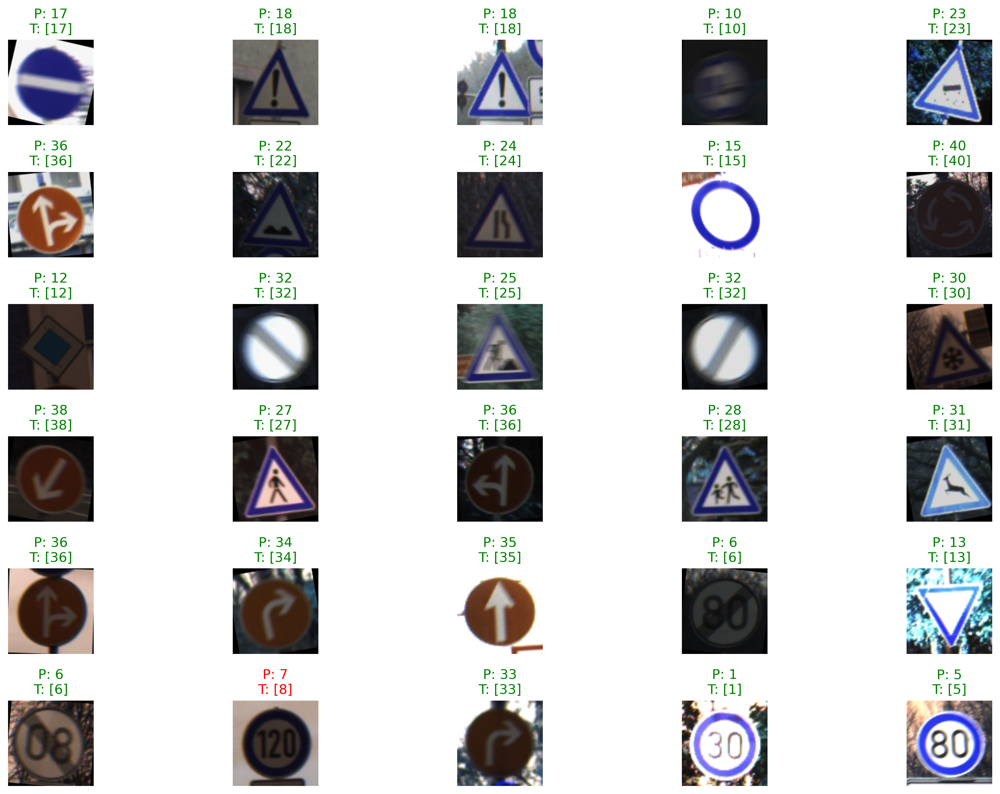

# 🧠 GTSRB – Traffic Sign Recognition using Deep Learning

## 🚗 Overview
This project focuses on **automatic traffic sign recognition** using the **German Traffic Sign Recognition Benchmark (GTSRB)** dataset.  
The goal is to train a deep learning model capable of accurately classifying **43 different types of traffic signs** from real-world images.  

The model was built and trained using **TensorFlow / Keras**, achieving strong classification performance suitable for real-time driver assistance systems or embedded AI applications.

---

## 📊 Dataset
**Source:** [GTSRB on Kaggle](https://www.kaggle.com/datasets/meowmeowmeowmeowmeow/gtsrb-german-traffic-sign)

- 🖼 **Total Images:** ~50,000  
- 🔢 **Classes:** 43 unique traffic sign categories  
- 📐 **Image Size:** Typically resized to `32x32` or `48x48` pixels  
- ✏️ **Split:** 80% training / 20% testing  
- 🧩 Includes varied lighting, occlusion, and viewing angles for robust generalization.

---

## 🧠 Model Architecture

The model is based on a **custom CNN** architecture with multiple convolutional and pooling layers.  
It leverages **ReLU activation**, **Batch Normalization**, and **Dropout** for optimal generalization.

##### 📥 Input: MRI Image (128x128 RGB)  
##### ├── 🧩 Conv2D (32 filters, 3×3) + ReLU + MaxPooling (2×2)  
##### ├── 🧩 Conv2D (64 filters, 3×3) + ReLU + MaxPooling (2×2)  
##### ├── 🔄 Flatten  
##### ├── ⚙️ Dense (128 units) + ReLU + Dropout (0.5)  
##### └── 🎯 Output Layer: Dense (2 units) + Softmax  

---

## ⚙️ Training Details
- **Framework:** TensorFlow / Keras  
- **Loss Function:** Categorical Crossentropy  
- **Optimizer:** Adam  
- **Metrics:** Accuracy  
- **Epochs:** 20–50 (depending on configuration)  
- **Batch Size:** 32 or 64  
- **Data Augmentation:** Rotation, zoom, brightness, flipping  

---

## 📈 Results
After training, the model achieved:

| Metric | Value |
|:-------|:-------|
| **Training Accuracy** | ~90–91% |
| **Validation Accuracy** | ~91–92% |
| **Test Accuracy** | ~91–92% |
| **Loss** | Decreasing steadily with no overfitting |

🟢 The confusion matrix and sample predictions confirm strong recognition performance across all 43 traffic sign categories.
---

## 🖼 Example Predictions

---

## 🧮 Confusion Matrix
The confusion matrix shows clear differentiation between visually similar signs such as:
- **Speed Limit 60 vs 70**
- **Stop vs No Entry**
- **Priority Road vs Warning Signs**

---

## 🧑‍💻 Author

**Denys**  
Passionate about AI, healthcare, and computer vision.  
Reach me at: [denys.zakharov.work@gmail.com]  

---

## 🪪 License

This project is licensed under the **MIT License** — feel free to use and modify it.  

---
